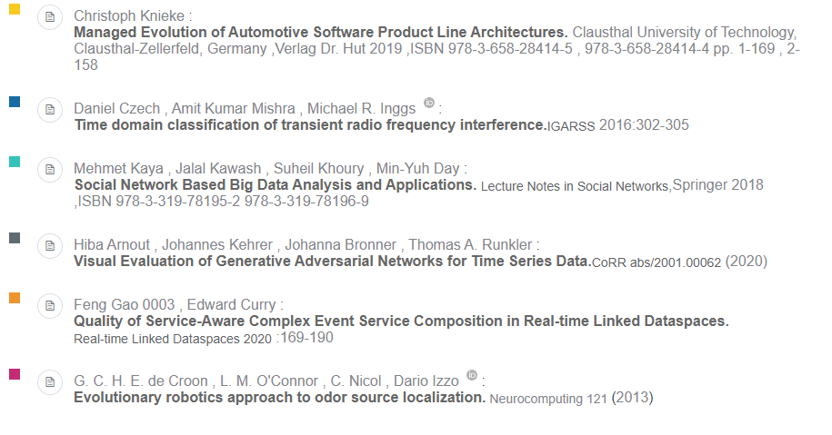
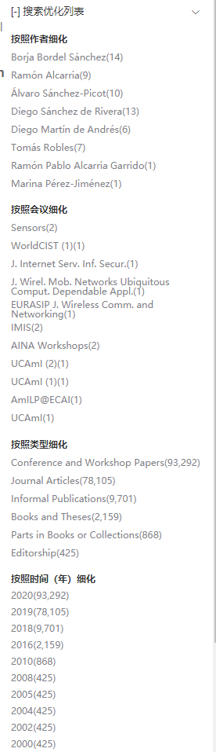
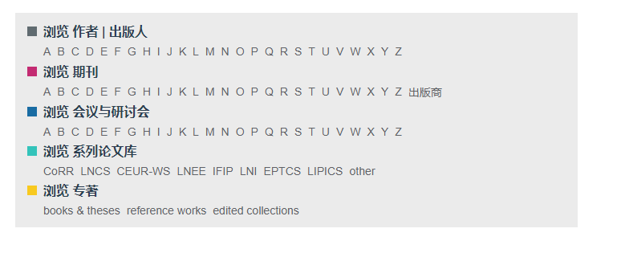
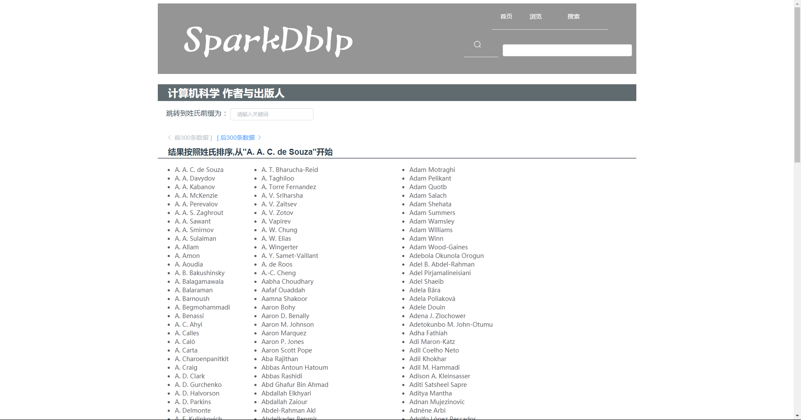
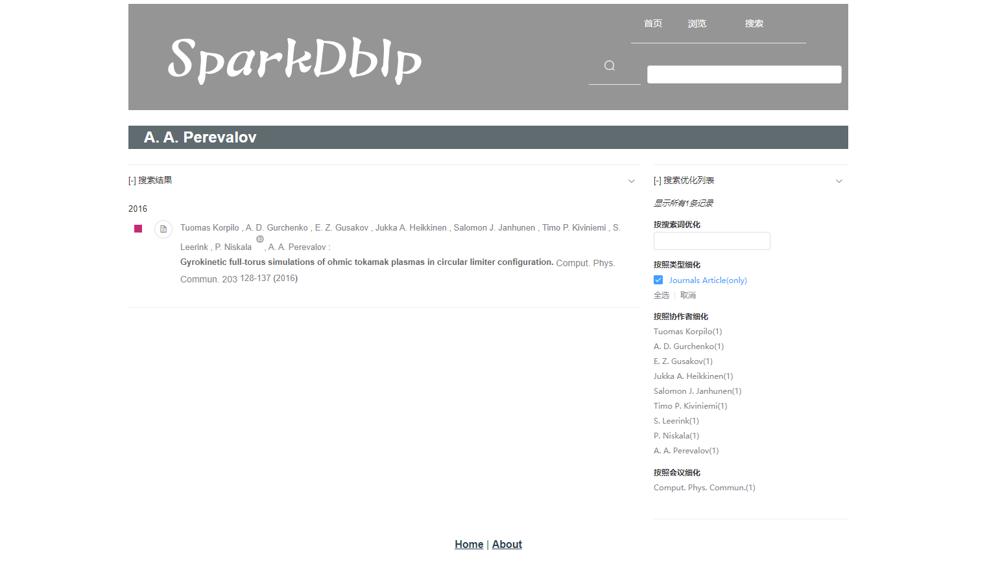

# sparkdblp-font

####7.16 实验记录
#####组件内容及功能
    bookTypeItem 下有六种类型文档表现形式
   
    
    refineList dblp右侧选择列表（AuthorRefineList废弃）
   
   
    refineListItem 选择列表组件（作者，类型，类型多选框，会议，时间）
    AuthorCompleteResult 个人详情页组件（集成匹配结果与选择列表过滤）
    ClassNavigatain dblp首页导航菜单（实现人名导航搜索）
   
   
    CompleteResult 搜索匹配结果组件
    MainPageMenu 顶部导航栏
    SearchBar 搜索栏
   
    
#### views内容
    brows 浏览结果（实现人名浏览）
   
   
    Result 详细结果（实现个人精确匹配结果浏览）
   
   
    Search 搜索页面 （搜索规则，搜索人名，组合搜索）
####7.18 实验记录
    bookTypeItem下添加新类型Reference Works
    完成右侧优化列表与返回结果的联动
